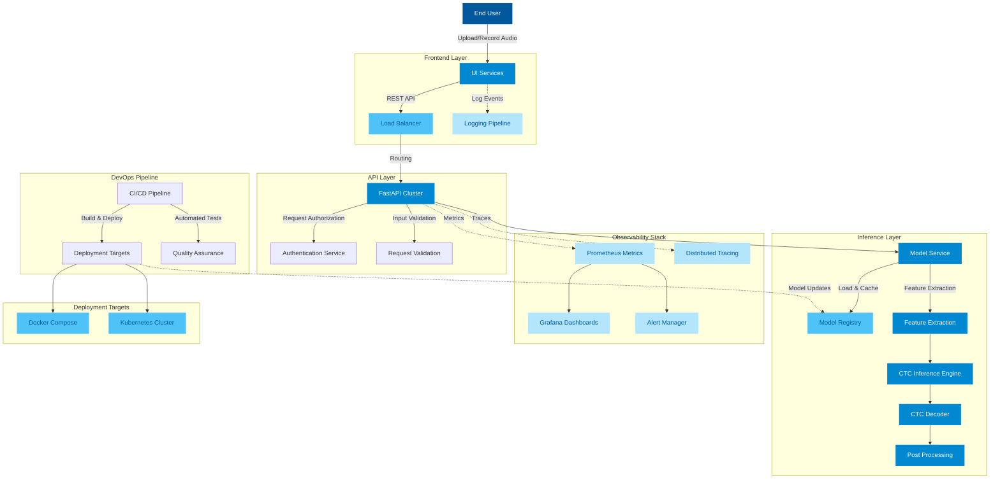
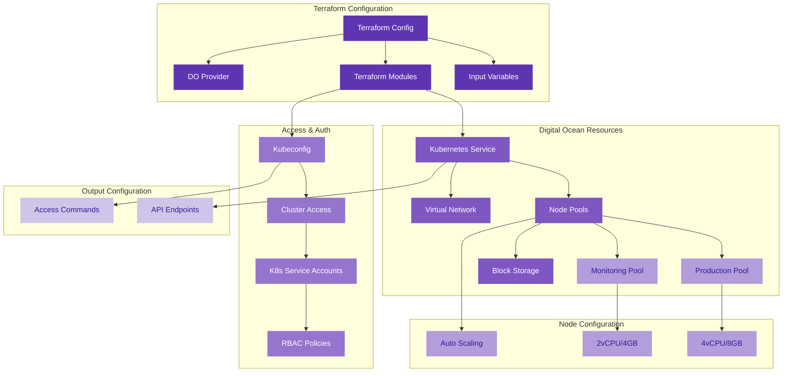
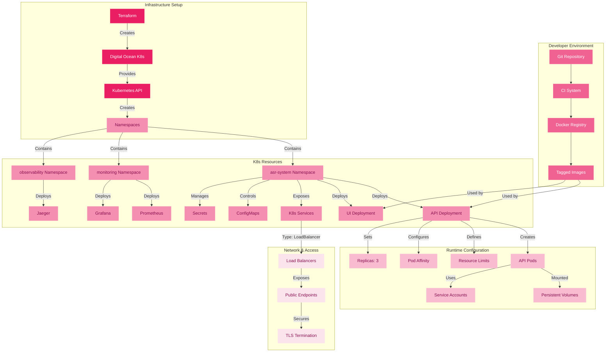
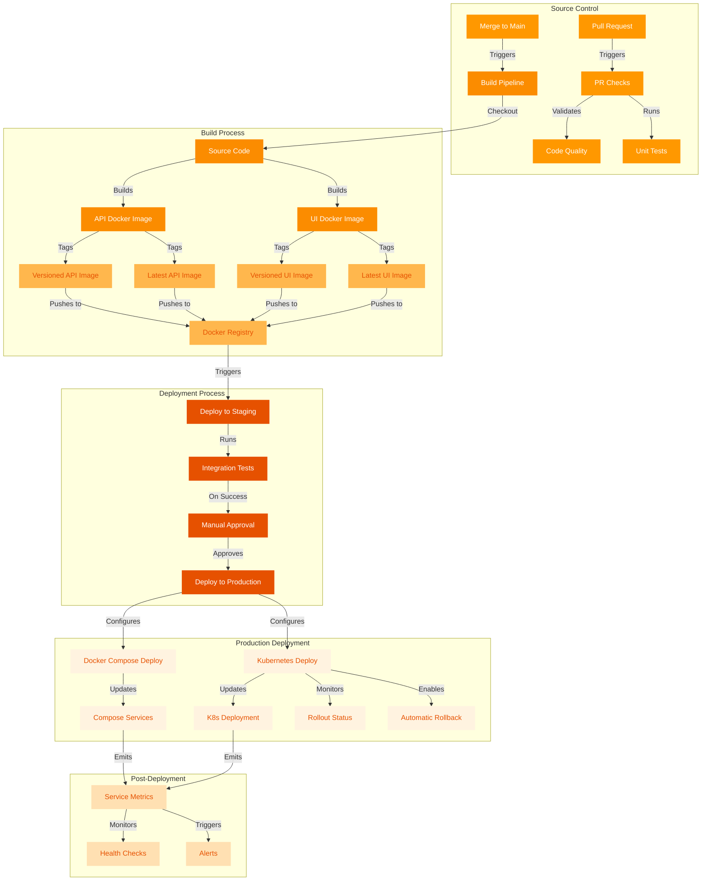

## 📊 System Architecture

```mermaid
graph TD
    User[End User] -->|Upload/Record Audio| UI
    
    subgraph "Frontend Layer"
        UI[UI Services]
        UI --> |REST API| LoadBalancer[Load Balancer]
        UI -.->|Log Events| LogPipeline
    end
    
    subgraph "API Layer"
        LoadBalancer -->|Routing| APICluster[FastAPI Cluster]
        APICluster -->|Request Authorization| Auth[Authentication Service]
        APICluster -->|Input Validation| Validation[Request Validation]
    end
    
    subgraph "Inference Layer"
        APICluster --> ModelService[Model Service]
        ModelService -->|Load & Cache| ModelRegistry[Model Registry]
        ModelService -->|Feature Extraction| FeatureExtractor[Feature Extraction]
        FeatureExtractor --> ModelInference[CTC Inference Engine]
        ModelInference --> Decoder[CTC Decoder]
        Decoder --> PostProcessor[Post Processing]
    end
    
    subgraph "Observability Stack"
        APICluster -.->|Metrics| Prometheus[Prometheus Metrics]
        APICluster -.->|Traces| Jaeger[Distributed Tracing]
        Prometheus --> Grafana[Grafana Dashboards]
        LogPipeline[Logging Pipeline]
        Alerts[Alert Manager]
        Prometheus --> Alerts
    end
    
    subgraph "DevOps Pipeline"
        CICD[CI/CD Pipeline] -->|Build & Deploy| Deployment[Deployment Targets]
        CICD -->|Automated Tests| QA[Quality Assurance]
    end
    
    subgraph "Deployment Targets"
        Deployment --> DockerCompose[Docker Compose]
        Deployment --> K8sCluster[Kubernetes Cluster]
        Deployment -.->|Model Updates| ModelRegistry
    end
    
    classDef primary fill:#01579b,stroke:#01579b,color:white,stroke-width:0px;
    classDef services fill:#0288d1,stroke:#0288d1,color:white,stroke-width:0px;
    classDef infra fill:#4fc3f7,stroke:#4fc3f7,color:#01579b,stroke-width:0px;
    classDef monitor fill:#b3e5fc,stroke:#81d4fa,color:#01579b,stroke-width:0px;
    
    class User primary;
    class UI,APICluster,ModelService,FeatureExtractor,ModelInference,Decoder,PostProcessor services;
    class LoadBalancer,DockerCompose,K8sCluster,ModelRegistry infra;
    class Prometheus,Grafana,Jaeger,LogPipeline,Alerts monitor;
```

## 🛠️ Terraform Infrastructure Setup

```mermaid
graph TD
    subgraph "Terraform Configuration"
        TFConfig[Terraform Config]
        Variables[Input Variables]
        Modules[Terraform Modules]
        Providers[DO Provider]
        TFConfig --> Variables
        TFConfig --> Modules
        TFConfig --> Providers
    end
    
    subgraph "Digital Ocean Resources"
        DOKS[Kubernetes Service]
        NodePools[Node Pools]
        NodePool1[Production Pool]
        NodePool2[Monitoring Pool]
        VPC[Virtual Network]
        StorageVolumes[Block Storage]
        
        DOKS --> NodePools
        NodePools --> NodePool1
        NodePools --> NodePool2
        DOKS --> VPC
        NodePools --> StorageVolumes
    end
    
    subgraph "Access & Auth"
        KubeConfig[Kubeconfig]
        ClusterAccess[Cluster Access]
        ServiceAccounts[K8s Service Accounts]
        RBAC[RBAC Policies]
        
        KubeConfig --> ClusterAccess
        ClusterAccess --> ServiceAccounts
        ServiceAccounts --> RBAC
    end
    
    Modules --> DOKS
    Modules --> KubeConfig
    
    subgraph "Node Configuration"
        NodePool1 --> NodeConfig1[4vCPU/8GB]
        NodePool2 --> NodeConfig2[2vCPU/4GB]
        AutoScaler[Auto Scaling]
        NodePools --> AutoScaler
    end
    
    subgraph "Output Configuration"
        APIEndpoints[API Endpoints]
        AccessCommands[Access Commands]
        DOKS --> APIEndpoints
        KubeConfig --> AccessCommands
    end
    
    classDef tfconfig fill:#5E35B1,stroke:#5E35B1,color:white,stroke-width:0px;
    classDef resources fill:#7E57C2,stroke:#7E57C2,color:white,stroke-width:0px;
    classDef access fill:#9575CD,stroke:#9575CD,color:white,stroke-width:0px;
    classDef config fill:#B39DDB,stroke:#B39DDB,color:#311B92,stroke-width:0px;
    classDef output fill:#D1C4E9,stroke:#D1C4E9,color:#311B92,stroke-width:0px;
    
    class TFConfig,Variables,Modules,Providers tfconfig;
    class DOKS,NodePools,VPC,StorageVolumes resources;
    class KubeConfig,ClusterAccess,ServiceAccounts,RBAC access;
    class NodePool1,NodePool2,NodeConfig1,NodeConfig2,AutoScaler config;
    class APIEndpoints,AccessCommands output;
```

## 🧠 Model Architecture

```mermaid
graph LR
    subgraph "Input Processing"
        Audio[Audio Input] --> Feature[Feature Extraction]
        Feature -->|80-dim Mel Spectrogram| Encoder
    end

    subgraph "PhoWhisper Encoder"
        Encoder[Transformer Encoder] -->|Hidden States| ContextRep[Contextual Representations]
        
        Encoder -->|Self-Attention| SelfAttn[Self-Attention Layers]
        Encoder -->|Feed-Forward| FFN[Feed-Forward Networks]
        Encoder -->|Layer Norm| LayerNorm[Layer Normalization]
        
        SelfAttn ----> Encoder
        FFN ----> Encoder
        LayerNorm ----> Encoder
    end
    
    subgraph "CTC Head"
        ContextRep -->|Projection| Linear1[Linear Layer]
        Linear1 -->|Activation| GELU[GELU Activation]
        GELU -->|Normalization| NormLayer[Layer Normalization]
        NormLayer -->|Projection| Linear2[Linear Projection]
        Linear2 -->|dim=vocab_size| Logits[Frame-Level Logits]
    end
    
    subgraph "CTC Decoding"
        Logits -->|Argmax| TokenProbs[Token Probabilities]
        TokenProbs -->|Blank Removal| Removal[Remove Blank Tokens]
        Removal -->|Collapse Repeats| Collapse[Collapse Repeated Tokens]
        Collapse --> Output[Text Output]
    end
    
    classDef input fill:#81C784,stroke:#81C784,color:#1B5E20,stroke-width:0px;
    classDef encoder fill:#4CAF50,stroke:#4CAF50,color:white,stroke-width:0px;
    classDef encoderComponents fill:#A5D6A7,stroke:#A5D6A7,color:#1B5E20,stroke-width:0px;
    classDef ctcHead fill:#2E7D32,stroke:#2E7D32,color:white,stroke-width:0px;
    classDef decoder fill:#1B5E20,stroke:#1B5E20,color:white,stroke-width:0px;
    
    class Audio,Feature input;
    class Encoder,ContextRep encoder;
    class SelfAttn,FFN,LayerNorm encoderComponents;
    class Linear1,GELU,NormLayer,Linear2,Logits ctcHead;
    class TokenProbs,Removal,Collapse,Output decoder;
```

#### Kubernetes Deployment

```mermaid
graph TD
    subgraph "Developer Environment"
        GitRepo[Git Repository] --> CISystem[CI System]
        CISystem --> DockerRegistry[Docker Registry]
        DockerRegistry --> ImageTag[Tagged Images]
    end
    
    subgraph "Infrastructure Setup"
        TF[Terraform] -->|Creates| DOCluster[Digital Ocean K8s]
        DOCluster -->|Provides| K8s[Kubernetes API]
        K8s -->|Creates| Namespaces[Namespaces]
    end
    
    subgraph "K8s Resources"
        Namespaces -->|Contains| ASRNamespace[asr-system Namespace]
        Namespaces -->|Contains| MonNamespace[monitoring Namespace]
        Namespaces -->|Contains| ObsNamespace[observability Namespace]
        
        ASRNamespace -->|Deploys| APIDeployment[API Deployment]
        ASRNamespace -->|Deploys| UIDeployment[UI Deployment]
        ASRNamespace -->|Exposes| Services[K8s Services]
        ASRNamespace -->|Controls| ConfigMaps[ConfigMaps]
        ASRNamespace -->|Manages| Secrets[Secrets]
        
        MonNamespace -->|Deploys| Prometheus[Prometheus]
        MonNamespace -->|Deploys| Grafana[Grafana]
        
        ObsNamespace -->|Deploys| Jaeger[Jaeger]
        
        ImageTag -->|Used by| APIDeployment
        ImageTag -->|Used by| UIDeployment
    end
    
    subgraph "Runtime Configuration"
        APIDeployment -->|Creates| Pods[API Pods]
        APIDeployment -->|Defines| Resources[Resource Limits]
        APIDeployment -->|Configures| Affinity[Pod Affinity]
        APIDeployment -->|Sets| Replicas[Replicas: 3]
        
        Pods -->|Mounted| PersistentVolumes[Persistent Volumes]
        Pods -->|Uses| ServiceAccounts[Service Accounts]
    end
    
    subgraph "Network & Access"
        Services -->|Type: LoadBalancer| LB[Load Balancers]
        LB -->|Exposes| Ingress[Public Endpoints]
        Ingress -->|Secures| TLS[TLS Termination]
    end
    
    classDef development fill:#F06292,stroke:#F06292,color:white,stroke-width:0px;
    classDef infra fill:#E91E63,stroke:#E91E63,color:white,stroke-width:0px;
    classDef resources fill:#F48FB1,stroke:#F48FB1,color:#880E4F,stroke-width:0px;
    classDef runtime fill:#F8BBD0,stroke:#F8BBD0,color:#880E4F,stroke-width:0px;
    classDef network fill:#FCE4EC,stroke:#FCE4EC,color:#880E4F,stroke-width:0px;
    
    class GitRepo,CISystem,DockerRegistry,ImageTag development;
    class TF,DOCluster,K8s infra;
    class Namespaces,ASRNamespace,MonNamespace,ObsNamespace,APIDeployment,UIDeployment,Services,ConfigMaps,Secrets,Prometheus,Grafana,Jaeger resources;
    class Pods,Resources,Affinity,Replicas,PersistentVolumes,ServiceAccounts runtime;
    class LB,Ingress,TLS network;
```

## 🔄 CI/CD Pipeline

```mermaid
graph TD
    subgraph "Source Control"
        PR[Pull Request] -->|Triggers| PRChecks[PR Checks]
        PRChecks -->|Validates| CodeQuality[Code Quality]
        PRChecks -->|Runs| UnitTests[Unit Tests]
        
        MergeMain[Merge to Main] -->|Triggers| BuildPipeline[Build Pipeline]
    end
    
    subgraph "Build Process"
        BuildPipeline -->|Checkout| SourceCode[Source Code]
        SourceCode -->|Builds| APIImage[API Docker Image]
        SourceCode -->|Builds| UIImage[UI Docker Image]
        
        APIImage -->|Tags| VersionedAPI[Versioned API Image]
        APIImage -->|Tags| LatestAPI[Latest API Image]
        UIImage -->|Tags| VersionedUI[Versioned UI Image]
        UIImage -->|Tags| LatestUI[Latest UI Image]
        
        VersionedAPI -->|Pushes to| Registry[Docker Registry]
        LatestAPI -->|Pushes to| Registry
        VersionedUI -->|Pushes to| Registry
        LatestUI -->|Pushes to| Registry
    end
    
    subgraph "Deployment Process"
        Registry -->|Triggers| DeployStaging[Deploy to Staging]
        DeployStaging -->|Runs| IntegrationTests[Integration Tests]
        IntegrationTests -->|On Success| ApprovalGate[Manual Approval]
        ApprovalGate -->|Approves| DeployProd[Deploy to Production]
    end
    
    subgraph "Production Deployment"
        DeployProd -->|Configures| DockerDeploy[Docker Compose Deploy]
        DeployProd -->|Configures| K8sDeploy[Kubernetes Deploy]
        
        DockerDeploy -->|Updates| ComposeService[Compose Services]
        K8sDeploy -->|Updates| K8sService[K8s Deployment]
        
        K8sDeploy -->|Monitors| Rollout[Rollout Status]
        K8sDeploy -->|Enables| Rollback[Automatic Rollback]
    end
    
    subgraph "Post-Deployment"
        ComposeService -->|Emits| ServiceMetrics[Service Metrics]
        K8sService -->|Emits| ServiceMetrics
        ServiceMetrics -->|Monitors| HealthChecks[Health Checks]
        ServiceMetrics -->|Triggers| Alerts[Alerts]
    end
    
    classDef source fill:#FF9800,stroke:#FF9800,color:white,stroke-width:0px;
    classDef build fill:#FB8C00,stroke:#FB8C00,color:white,stroke-width:0px;
    classDef images fill:#FFB74D,stroke:#FFB74D,color:#E65100,stroke-width:0px;
    classDef deploy fill:#E65100,stroke:#E65100,color:white,stroke-width:0px;
    classDef production fill:#FFF3E0,stroke:#FFE0B2,color:#E65100,stroke-width:0px;
    classDef monitoring fill:#FFE0B2,stroke:#FFE0B2,color:#E65100,stroke-width:0px;
    
    class PR,PRChecks,CodeQuality,UnitTests,MergeMain source;
    class BuildPipeline,SourceCode,APIImage,UIImage build;
    class VersionedAPI,LatestAPI,VersionedUI,LatestUI,Registry images;
    class DeployStaging,IntegrationTests,ApprovalGate,DeployProd deploy;
    class DockerDeploy,K8sDeploy,ComposeService,K8sService,Rollout,Rollback production;
    class ServiceMetrics,HealthChecks,Alerts monitoring;
```