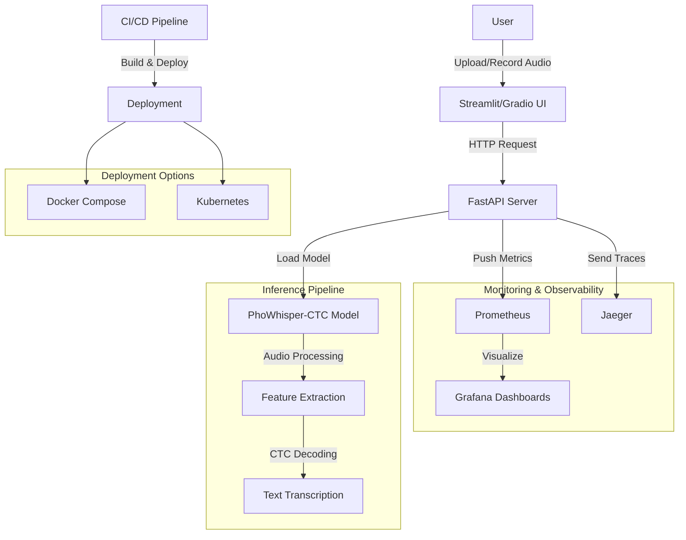
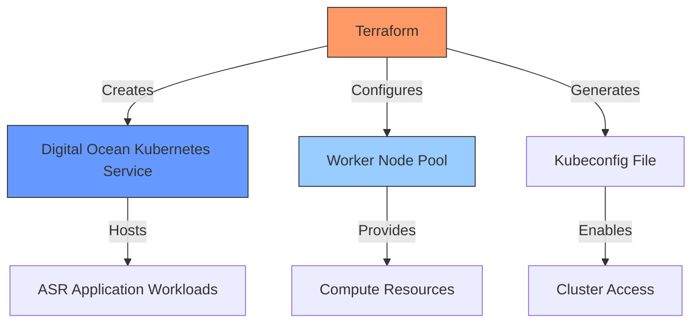
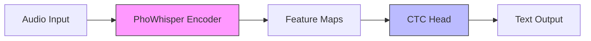
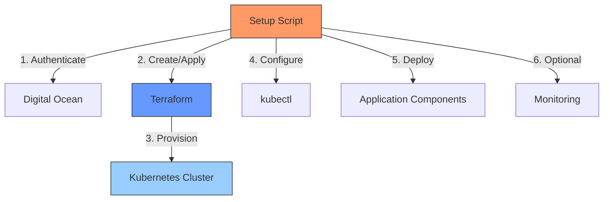
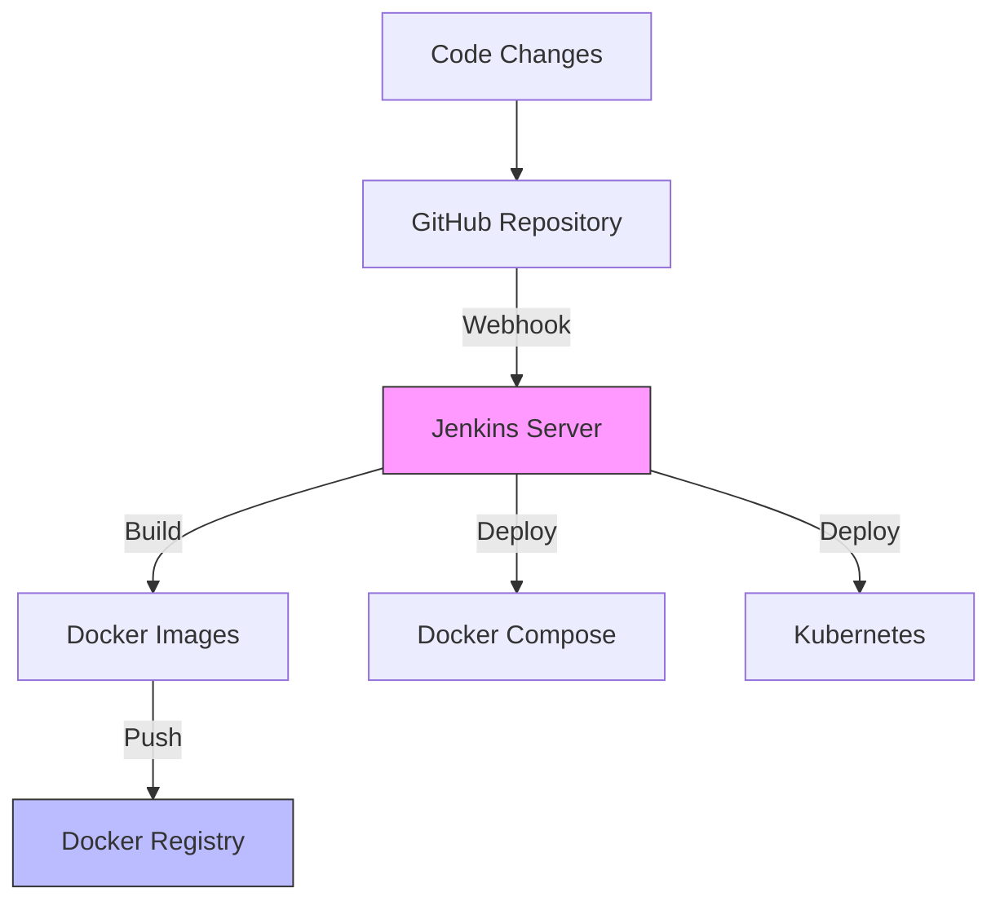

# Vietnamese Speech Recognition with PhoWhisper-CTC

[](https://opensource.org/licenses/MIT)
[](https://hub.docker.com/r/tuandung12092002/asr-fastapi-server)
[](https://github.com/tuandung222/Convert-PhoWhisper-ASR-from-encdec-to-ctc/actions/workflows/docker-publish.yml)

A high-performance Vietnamese Automatic Speech Recognition (ASR) system using a CTC-based architecture derived from PhoWhisper. This project implements a complete ML system with FastAPI backend, interactive UI, observability, and cloud deployment options.

## 🚀 Features

- **Fast and Accurate** Vietnamese speech recognition (2-3x faster than real-time)
- **CTC-based architecture** for efficient inference and simplified training
- **Multiple deployment options**:
  - **Docker Compose** for local and single-server deployment
  - **Kubernetes** for scalable cloud deployment on Digital Ocean
- **Comprehensive monitoring**:
  - Prometheus metrics
  - Grafana dashboards
  - Jaeger distributed tracing
- **Modern UI options**:
  - Streamlit web interface
  - Gradio demo
- **CI/CD pipeline** with Jenkins and GitHub Actions
- **ONNX optimization** with INT8 quantization for CPU

## 📊 System Architecture



## 🛠️ Terraform Infrastructure Setup

For Kubernetes deployment, we use Terraform to provision the required infrastructure on Digital Ocean:



### Key Infrastructure Components

The Terraform configuration creates the following resources:

- **Kubernetes Cluster**: A DOKS (Digital Ocean Kubernetes Service) cluster with:
  - Kubernetes version: `1.32.2-do.0` (customizable)
  - Auto-upgrade enabled (maintenance window: Sundays at 04:00)
  - Region: `sgp1` (Singapore by default, customizable)

- **Node Pool Configuration**:
  - Default size: `s-2vcpu-4gb` (2 vCPU, 4GB RAM, customizable)
  - Initial node count: 2 (customizable)
  - Auto-scaling enabled (min: 1, max: initial count + 1)

- **Outputs**: The Terraform configuration provides useful outputs:
  - Cluster ID and endpoint
  - Path to kubeconfig file
  - Ready-to-use kubectl connection command

### Customization Options

You can customize the infrastructure by modifying `terraform.tfvars`:

```
# API token (required)
do_token = "your-digitalocean-api-token"

# Region (optional, default: sgp1)
region = "sgp1"

# Kubernetes version (optional)
kubernetes_version = "1.32.2-do.0"

# Node size (optional)
node_size = "s-2vcpu-4gb"

# Node count (optional)
node_count = 2
```

## 🧠 Model Architecture

The model improves over traditional encoder-decoder ASR systems by replacing the decoder with a CTC head:



### Advantages of CTC Architecture

- **Faster inference**: 2-3x faster than encoder-decoder models
- **Simpler training**: No need for autoregressive decoding
- **Reduced complexity**: Fewer parameters, smaller memory footprint
- **Streaming-friendly**: Better for real-time applications

## 🛠️ ONNX Optimization

The model supports ONNX export with INT8 quantization for faster inference on CPU:

### Benefits

- **INT8 Quantization**: 3-4x speedup over FP32 with minimal accuracy loss
- **Memory Reduction**: ~75% smaller memory footprint
- **CPU Optimization**: Better cache utilization and vector operations

### Using ONNX Models

```python
from src.models.inference_model import create_asr_model

# Create model with ONNX optimization
model = create_asr_model(
    model_id="tuandunghcmut/PhoWhisper-tiny-CTC",
    device="cpu",
    model_type="onnx"  # Use ONNX optimized version
)

# Transcribe audio
result = model.transcribe("path/to/audio.wav")
print(result["text"])
```

## 🚢 Deployment Options

### Option 1: Docker Compose (Quick Start)

```bash
# Clone the repository
git clone https://github.com/tuandung222/Convert-PhoWhisper-ASR-from-encdec-to-ctc.git
cd Convert-PhoWhisper-ASR-from-encdec-to-ctc

# Run the full stack (API, UI, and monitoring)
docker-compose -f docker/docker-compose.base.yml \
               -f docker/docker-compose.api.yml \
               -f docker/docker-compose.ui.yml \
               -f docker/docker-compose.monitoring.yml up -d
```

This will start:
- FastAPI Server: http://localhost:8000
- Streamlit UI: http://localhost:8501
- Monitoring Stack:
  - Prometheus: http://localhost:9090
  - Grafana: http://localhost:3000 (username: admin, password: admin)
  - Jaeger: http://localhost:16686

### Option 2: Kubernetes on Digital Ocean

For production deployment with high availability and scalability:



#### Automated Deployment

The easiest way to deploy is using the provided setup script:

```bash
# Navigate to the k8s directory
cd k8s

# Make scripts executable (on Linux/Mac)
chmod +x setup.sh monitoring-setup.sh

# Run the setup script
./setup.sh
```

The Kubernetes deployment follows this process:
1. **Infrastructure provisioning** with Terraform to create a Kubernetes cluster on Digital Ocean
2. **Application deployment** with kubectl to deploy the components to the cluster

The automated setup script will:
- Authenticate with Digital Ocean using your API token
- Create and configure the Terraform files
- Provision a Kubernetes cluster on Digital Ocean with auto-scaling capabilities
- Configure kubectl to connect to the new cluster
- Deploy the ASR API (with 3 replicas) and UI components
- Optionally set up the monitoring stack with Prometheus, Grafana, and Jaeger

#### Manual Deployment

For more control over the process:

```bash
# 1. Create infrastructure with Terraform
cd terraform
cp terraform.tfvars.example terraform.tfvars
# Edit terraform.tfvars with your DO API token
terraform init
terraform apply

# 2. Configure kubectl
doctl kubernetes cluster kubeconfig save asr-k8s-cluster

# 3. Deploy application
kubectl apply -f k8s/base/namespace.yaml
kubectl apply -f k8s/base/

# 4. Optional: Set up monitoring
cd k8s
./monitoring-setup.sh
```

#### Accessing Services

After deployment, you can access the services via their LoadBalancer IP addresses:
```bash
# Get service endpoints
kubectl get svc -n asr-system
```

#### Kubernetes Resources Created

The deployment creates:
- **API Service**: 3 replicas with anti-affinity for high availability
- **UI Service**: Streamlit interface with LoadBalancer
- **Namespaces**: Separate namespaces for application and monitoring
- **Monitoring**: Prometheus, Grafana, and Jaeger (optional)

#### Cleanup

To remove all resources:
```bash
cd terraform
terraform destroy
```

### Kubernetes Project Structure

The `k8s/` directory is organized as follows:

```
k8s/
├── setup.sh                 # Main setup script for full deployment
├── monitoring-setup.sh      # Script for setting up the monitoring stack
├── base/                    # Core application manifests
│   ├── namespace.yaml       # ASR system namespace
│   ├── api-deployment.yaml  # API deployment with 3 replicas
│   ├── api-service.yaml     # API service (LoadBalancer)
│   ├── ui-deployment.yaml   # UI deployment
│   └── ui-service.yaml      # UI service (LoadBalancer)
└── monitoring/              # Monitoring configuration
    ├── observability-namespace.yaml  # Namespace for tracing
    ├── prometheus-values.yaml        # Prometheus Helm values
    └── jaeger-instance.yaml          # Jaeger configuration
```

The deployment process:
1. `setup.sh` handles infrastructure creation and application deployment
2. `monitoring-setup.sh` sets up the monitoring stack using Helm:
   - Prometheus and Grafana for metrics collection and visualization
   - Jaeger for distributed tracing
   - Pre-configured dashboards for ASR metrics

The setup creates three namespaces:
- `asr-system`: Contains the main application components
- `monitoring`: Contains Prometheus and Grafana
- `observability`: Contains Jaeger for distributed tracing

## 🖥️ API Usage

### Endpoints

- `GET /`: API information
- `GET /models`: List available models
- `GET /languages`: List supported languages
- `GET /health`: Health check
- `POST /transcribe`: Transcribe audio file

Example transcription request:

```bash
curl -X POST "http://localhost:8000/transcribe" \
  -H "accept: application/json" \
  -H "Content-Type: multipart/form-data" \
  -F "file=@/path/to/audio.wav" \
  -F "model=phowhisper-tiny-ctc" \
  -F "language=vi"
```

## 📊 Monitoring and Metrics

### Available Metrics

- **API Metrics**:
  - HTTP request count by endpoint and status
  - Request duration histograms
  - Endpoint errors and exceptions

- **ASR Model Metrics**:
  - Transcription count by model and language
  - Transcription processing time
  - Audio duration statistics
  - Inference operations in progress

- **System Metrics**:
  - Container CPU and memory usage
  - Host metrics via Node Exporter
  - Network traffic and disk I/O

### Grafana Dashboards

The system comes with pre-configured Grafana dashboards:
- ASR System Overview
- API Performance
- Node and Container metrics

## 🔄 CI/CD Pipeline

The project includes a complete CI/CD pipeline using Jenkins:



### Pipeline Features

- Automated builds on code changes
- Docker image creation and versioning
- Deployment to Docker Compose or Kubernetes
- Monitoring setup automation

## 🔍 Model Performance

- **Word Error Rate (WER)**: ~30% on the VietBud500 test set
- **Real-time factor**: <0.5x (more than 2x faster than real-time)
- **Memory usage**: <400MB
- **Processing time**: ~0.02 seconds per example on standard GPU hardware

## 🛠️ Development Guide

### Setting Up Local Development Environment

```bash
# Clone the repository
git clone https://github.com/tuandung222/Convert-PhoWhisper-ASR-from-encdec-to-ctc.git
cd Convert-PhoWhisper-ASR-from-encdec-to-ctc

# Install API dependencies
pip install -r api/requirements.txt

# Install UI dependencies
pip install -r ui/requirements.txt

# Run API server
cd api
uvicorn app:app --host 0.0.0.0 --port 8000

# In another terminal, run the UI
cd ui
streamlit run app.py
```

### Pre-commit Hooks

This project uses pre-commit hooks to ensure code quality and consistency:

```bash
# Install pre-commit
pip install pre-commit

# Install the git hooks
pre-commit install

# Run pre-commit on all files
pre-commit run --all-files
```

## 🔧 Troubleshooting

### Common Issues

1. **API server fails to start**:
   - Check if the port is already in use
   - Verify network connectivity

2. **Model fails to load**:
   - Check available memory
   - Verify model paths and credentials

3. **Poor transcription quality**:
   - Check audio quality (sampling rate, noise levels)
   - Try different model sizes (tiny, base, small)

4. **Kubernetes deployment issues**:
   - Verify Digital Ocean API token permissions
   - Check resource constraints and quotas
   - Examine pod logs for detailed errors

## 📄 License

This project is licensed under the MIT License - see the LICENSE file for details.

## 🙏 Acknowledgments

- VinAI Research for the PhoWhisper-Tiny model
- The creators of the VietBud500 dataset
- The FastAPI, PyTorch, and Streamlit communities
